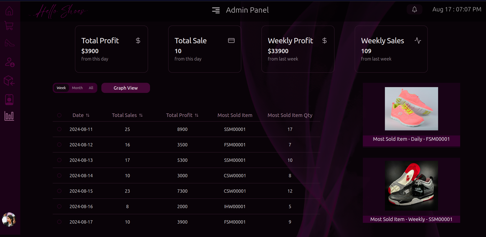

# Hello Shoes - POS

This web application - front-end using React is for a POS application for a shoe shop designed for both admin and cashier roles, enabling them to manage transactions, and customers, issue shoes and other materials, and control all data. It also includes functionality for managing employees to streamline operations.


## Technology stack
   ```markdown
    ✅ Frontend: React Vite TS
    ✅ Backend: Springboot Java
    ✅ Database: MySQL, Hibernate
    ✅ Authentication: SpringSecurity, JWT
    ✅ Styling: Tailwind Shadcn
   ```

## Features


### Here you can order and pay by either card or cash


### Here you get to add customer, similar there employee,supplier,inventory forms


### You can preview those data and edit as you like


### Admin page is only got limited access preview all sale details even with graph preview



### Even got refund option


## Installation
1. **Clone the repository:**
   ```bash
   https://github.com/bethmij/Hello-Shoes-Frontend.git

2. **Install dependencies:**
   ```bash
   npm install


4. **Run the application:**
   ```bash
   npm run dev